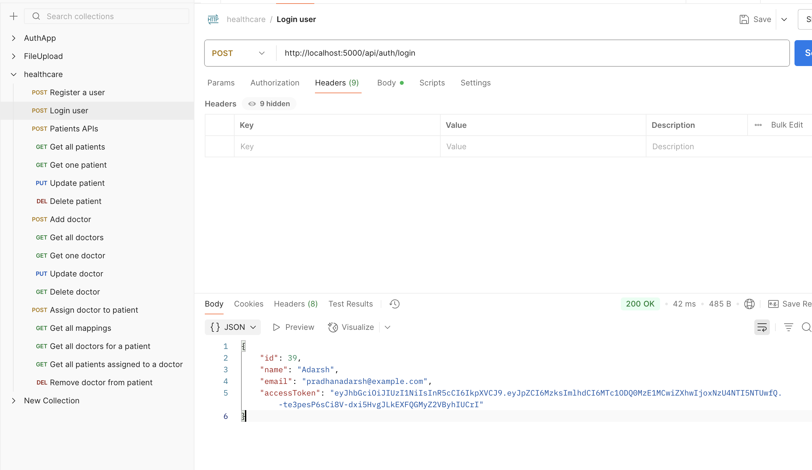
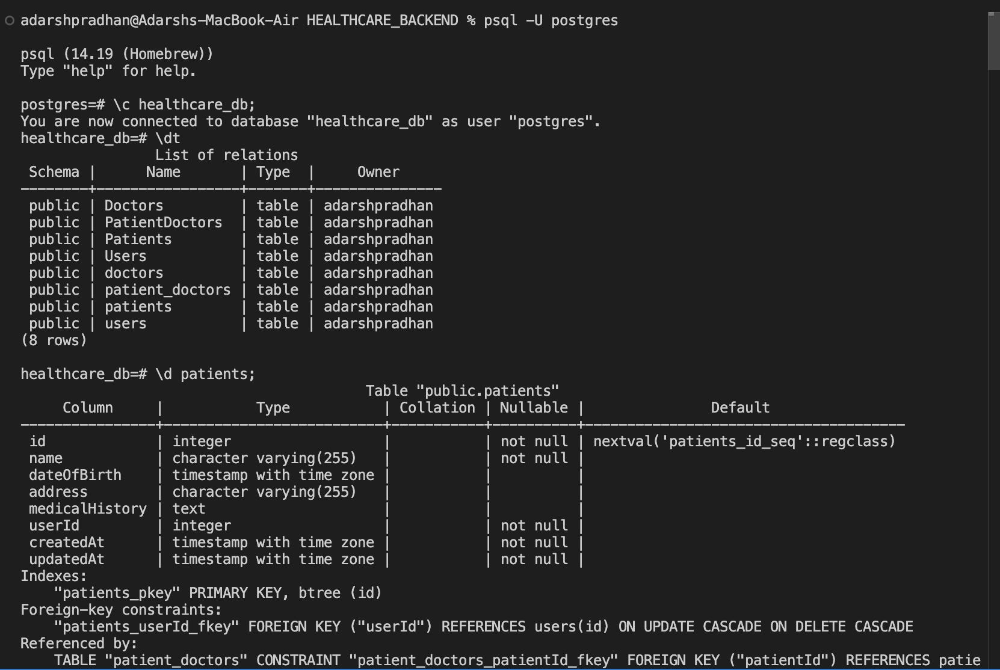
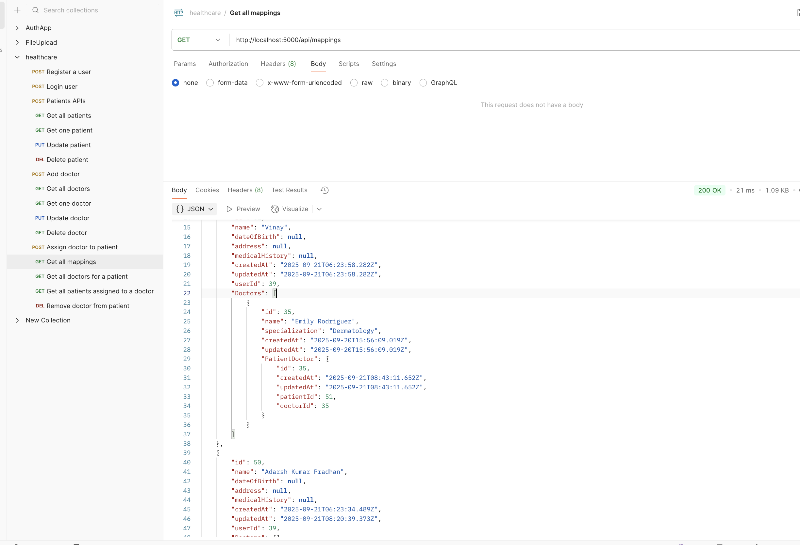
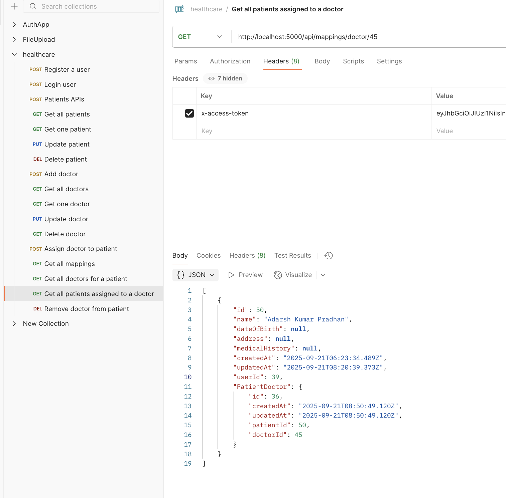
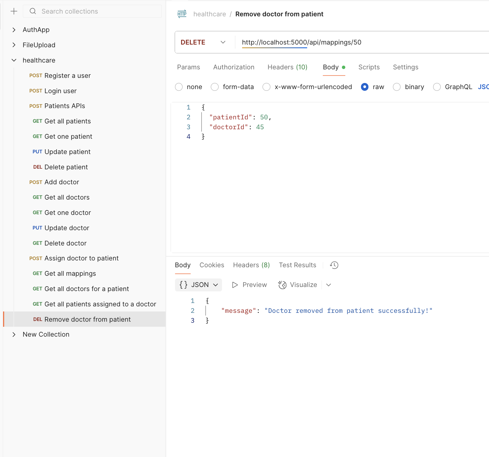

# Healthcare Backend API 🏥

> A robust Node.js backend application for comprehensive healthcare management system with advanced patient-doctor mapping functionality.

[](https://nodejs.org/)
[](https://expressjs.com/)
[](https://postgresql.org/)
[](https://opensource.org/licenses/MIT)

## 🚀 Features

- 🔐 **Secure Authentication** - JWT-based user registration and login system
- 👥 **Patient Management** - Complete CRUD operations for patient records
- 👨‍⚕️ **Doctor Management** - Comprehensive doctor profile management
- 🔗 **Patient-Doctor Mapping** - Advanced relationship management between patients and doctors
- 🛡️ **Security** - Password hashing with bcryptjs and JWT token authentication
- 🗄️ **Database Integration** - PostgreSQL with Sequelize ORM for robust data management

## 🛠️ Technology Stack

| Component | Technology |
|-----------|------------|
| **Backend Framework** | Node.js + Express.js |
| **Database** | PostgreSQL |
| **ORM** | Sequelize |
| **Authentication** | JWT (JSON Web Tokens) |
| **Password Security** | bcryptjs |
| **Environment Management** | dotenv |

## 📚 API Endpoints

### 🔐 Authentication
| Method | Endpoint | Description | Status |
|--------|----------|-------------|---------|
| `POST` | `/api/auth/register` | Register new user | ✅ Tested |
| `POST` | `/api/auth/login` | User login authentication | ✅ Tested |

### 👥 Patient Management
| Method | Endpoint | Description | Status |
|--------|----------|-------------|---------|
| `GET` | `/api/patients` | Get all patients | ✅ Tested |
| `POST` | `/api/patients` | Create new patient | ✅ Tested |
| `PUT` | `/api/patients/:id` | Update patient information | ✅ Tested |
| `DELETE` | `/api/patients/:id` | Remove patient record | ✅ Tested |

### 👨‍⚕️ Doctor Management
| Method | Endpoint | Description | Status |
|--------|----------|-------------|---------|
| `GET` | `/api/doctors` | Get all doctors | ✅ Tested |
| `POST` | `/api/doctors` | Add new doctor | ✅ Tested |
| `PUT` | `/api/doctors/:id` | Update doctor profile | ✅ Tested |
| `DELETE` | `/api/doctors/:id` | Remove doctor record | ✅ Tested |

### 🔗 Patient-Doctor Mappings
| Method | Endpoint | Description | Status |
|--------|----------|-------------|---------|
| `GET` | `/api/mappings` | Get all patient-doctor mappings | ✅ Tested |
| `POST` | `/api/mappings` | Create patient-doctor relationship | ✅ Tested |
| `GET` | `/api/mappings/patient/:id/doctors` | Get all doctors for a patient | ✅ Tested |
| `GET` | `/api/mappings/doctor/:id/patients` | Get all patients assigned to a doctor | ✅ Tested |
| `DELETE` | `/api/mappings` | Remove doctor from patient | ✅ Tested |

## 🚀 Quick Start

### Prerequisites
- Node.js (v16 or higher)
- PostgreSQL (v13 or higher)
- npm or yarn package manager

### Installation

1. **Clone the repository**
   ```bash
   git clone https://github.com/Adarshkumar24/healthcare_backend.git
   cd healthcare_backend
   ```

2. **Install dependencies**
   ```bash
   npm install
   ```

3. **Environment Setup**
   
   Create a `.env` file in the root directory:
   ```env
   # Database Configuration
   DB_HOST=your_database_host
   DB_USER=your_database_user
   DB_PASS=your_database_password
   DB_NAME=your_database_name
   DB_PORT=5432

   # JWT Configuration
   JWT_SECRET=your_super_secure_jwt_secret_key
   JWT_EXPIRE=24h

   # Server Configuration
   PORT=3000
   NODE_ENV=development
   ```

4. **Database Setup**
   
   Ensure PostgreSQL is running and create your database:
   ```sql
   CREATE DATABASE your_database_name;
   ```

5. **Start the server**
   ```bash
   # Development mode
   npm run dev
   
   # Production mode
   npm start
   ```

The server will be running at `http://localhost:3000`

## 📸 API Testing Screenshots

All endpoints have been thoroughly tested and validated. Below are the screenshots demonstrating the functionality:

### 🔐 Authentication System

#### User Registration

*Successfully implemented user registration with encrypted password storage*

#### User Login

*JWT-based authentication system working perfectly*

### 🗄️ Database Connection

*PostgreSQL database successfully connected and configured*

### 🔗 Patient-Doctor Mapping System

#### Get All Mappings

*Complete list of patient-doctor relationships*

#### Get All Doctors for a Patient

*Retrieve all doctors assigned to a specific patient*

#### Get All Patients for a Doctor

*Retrieve all patients assigned to a specific doctor*

#### Remove Doctor from Patient

*Successfully remove patient-doctor relationship*

## 🏗️ Project Architecture

## 🏗️ Project Architecture

```
healthcare_backend/
├── 📁 src/
│   ├── 📁 config/
│   │   └── 📄 db.config.js          # Database configuration
│   ├── 📁 controllers/
│   │   ├── 📄 auth.controller.js    # Authentication logic
│   │   ├── 📄 doctor.controller.js  # Doctor management
│   │   ├── 📄 mapping.controller.js # Patient-Doctor mappings
│   │   └── 📄 patient.controller.js # Patient management
│   ├── 📁 middleware/
│   │   └── 📄 auth.middleware.js    # JWT authentication middleware
│   ├── 📁 models/
│   │   ├── 📄 index.js              # Model associations
│   │   ├── 📄 user.model.js         # User model (authentication)
│   │   ├── 📄 doctor.model.js       # Doctor model
│   │   ├── 📄 patient.model.js      # Patient model
│   │   └── 📄 patientDoctor.model.js # Many-to-Many relationship
│   ├── 📁 routes/
│   │   ├── 📄 auth.routes.js        # Authentication routes
│   │   ├── 📄 doctor.routes.js      # Doctor API routes
│   │   ├── 📄 mapping.routes.js     # Mapping API routes
│   │   └── 📄 patient.routes.js     # Patient API routes
│   └── 📄 app.js                    # Express app configuration
├── 📁 screenshots/                  # API testing evidence
├── 📄 server.js                     # Application entry point
├── 📄 package.json                  # Project dependencies
└── 📄 README.md                     # Project documentation
```

## 🔧 Key Features Implementation

### 🔐 Authentication Flow
- **Registration**: Password hashing with bcryptjs + JWT token generation
- **Login**: Credential validation + JWT token issuance
- **Authorization**: JWT middleware protection for secured endpoints

### 🗄️ Database Design
- **Users Table**: Authentication credentials and user information
- **Patients Table**: Patient records and medical information
- **Doctors Table**: Doctor profiles and specialization details
- **PatientDoctor Table**: Many-to-many relationship mapping

### 🛡️ Security Features
- Password encryption using bcryptjs
- JWT token-based authentication
- Protected routes with middleware
- Environment variables for sensitive data
- Input validation and sanitization

## 🚀 API Response Format

### Success Response
```json
{
  "success": true,
  "message": "Operation completed successfully",
  "data": {
    // Response data
  }
}
```

### Error Response
```json
{
  "success": false,
  "message": "Error description",
  "error": {
    // Error details
  }
}
```

## 🤝 Contributing

1. Fork the repository
2. Create your feature branch (`git checkout -b feature/AmazingFeature`)
3. Commit your changes (`git commit -m 'Add some AmazingFeature'`)
4. Push to the branch (`git push origin feature/AmazingFeature`)
5. Open a Pull Request

## 📄 License

This project is licensed under the MIT License - see the [LICENSE](LICENSE) file for details.

## 📞 Contact & Support

- **Developer**: Adarsh Kumar
- **Repository**: [healthcare_backend](https://github.com/Adarshkumar24/healthcare_backend)
- **Issues**: [Report Bug](https://github.com/Adarshkumar24/healthcare_backend/issues)

---

⭐ **If you found this project helpful, please give it a star!** ⭐
